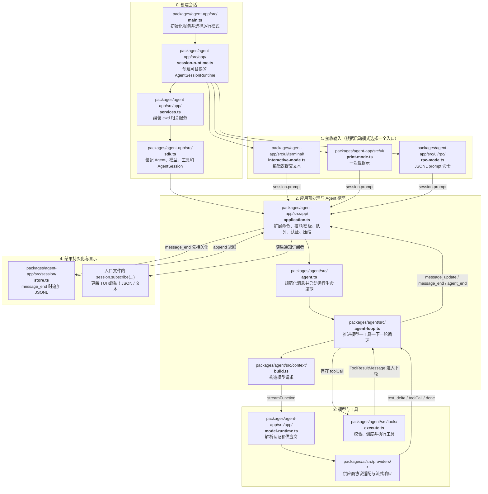

# Agent Core 架构与源码导航

- [运行架构](index.html)：系统怎样完成一个任务。
- [对话输入文件链](#对话输入会经过哪些文件)：直接在本文查看 Mermaid 图。
- [包依赖](packages.html)：代码怎样组织。
- [逐文件职责](file-index.html)：当前源码、测试与工具文件的可搜索索引。
- [文档导航](../README.md)。

## 对话输入会经过哪些文件

下面按一次普通对话输入的真实调用顺序展开。图中的每个节点都写出仓库相对路径；纵向布局用于避免浏览器把文件名缩得过小。

普通文本输入的主干是：入口文件 → application.ts → agent.ts → agent-loop.ts → context/build.ts → model-runtime.ts → providers/*。模型如果返回工具调用，会进入 tools/execute.ts 后回到 agent-loop.ts；每个完整消息由 application.ts 先写入 session/store.ts，随后订阅者才更新界面或输出。

## 一条主流程

`入口 → SDK 装配 → AgentSession 应用操作 → Agent Loop → 模型 → 工具 → 结果 → 下一轮`

会话记录先保存，显示订阅者再接收独立快照。上下文处理改变模型视图，不把展示层变成事实来源。HTML 展示完整会话树；JSONL 导出当前分支并默认携带归档。

## 产品包

| 目录 | 职责 | 内部依赖 |
|---|---|---|
| `packages/agent` | Loop、请求上下文、纯预算决策、工具执行与取消 | ai |
| `packages/ai` | 模型目录、认证和供应商协议 | 无 |
| `packages/agent-app` | 配置装配、用户操作、会话、实际工具、扩展与各运行入口 | agent、ai、tui |
| `packages/tui` | 通用终端输入、布局、渲染组件 | 无 |

公开 npm 名称为 `@liuxuedeng/agent-core`，命令为 `agent-core`。产品不依赖 Chord、旧 Harness 平台、SQLite 后端或仓库内的评测包。

## 学习顺序与关键文件

| 文件 | 作用 |
|---|---|
| [agent-loop.ts](../../packages/agent/src/agent-loop.ts) | 推进模型—工具反馈循环 |
| [context/build.ts](../../packages/agent/src/context/build.ts) | 从消息构造模型请求 |
| [context/budget.ts](../../packages/agent/src/context/budget.ts) | 纯函数计算压缩收益与窗口压力 |
| [tools/execute.ts](../../packages/agent/src/tools/execute.ts) | 参数校验、调度、取消及顺序稳定的结果 |
| [sdk.ts](../../packages/agent-app/src/sdk.ts) | 装配生产会话，默认采用保守工具调度 |
| [app/application.ts](../../packages/agent-app/src/app/application.ts) | 所有入口共用的会话业务操作 |
| [app/session-runtime.ts](../../packages/agent-app/src/app/session-runtime.ts) | 新建、恢复、导入、分叉及运行时替换 |
| [session/store.ts](../../packages/agent-app/src/session/store.ts) | JSONL 记录与分支 |
| [session/export/jsonl.ts](../../packages/agent-app/src/session/export/jsonl.ts) | HTML/JSONL 导出操作入口 |
| [session/artifacts.ts](../../packages/agent-app/src/session/artifacts.ts) | 归档携带、校验、恢复与引用投影 |
| [tools/index.ts](../../packages/agent-app/src/tools/index.ts) | 内置文件、搜索与 shell 工具工厂 |
| [tools/plan.ts](../../packages/agent-app/src/tools/plan.ts) | 模型计划更新工具 |
| [app/slash-commands.ts](../../packages/agent-app/src/app/slash-commands.ts) | 内置用户命令列表 |
| [extensions/loader.ts](../../packages/agent-app/src/extensions/loader.ts) | 外部扩展加载与注册 |
| [ui/renderers/tools/index.ts](../../packages/agent-app/src/ui/renderers/tools/index.ts) | 工具显示，不执行工具 |

`app`、`context`、`session`、`tools` 的运行时导入不得到达 UI。扩展使用的终端模块由外层入口提供。`/sdk` 和 `/session/export` 是无终端入口，公共根入口仍提供扩展 UI API。

## 边界与验证

应用采用 `auto` 调度：明确可并行的只读批次最多同时执行 4 个；含未声明或有副作用工具的批次串行。低层 Agent 的默认策略仍为显式并行，以避免把应用策略强加给全部宿主；并行同样受 4 个工作槽限制。

源码验证使用 `npm run check`，全量离线回归使用 `./test.sh`。真实模型评测参见 [评测说明](../Terminal-Bench评测说明.md)，不把离线测试通过等同于模型成绩提升。
