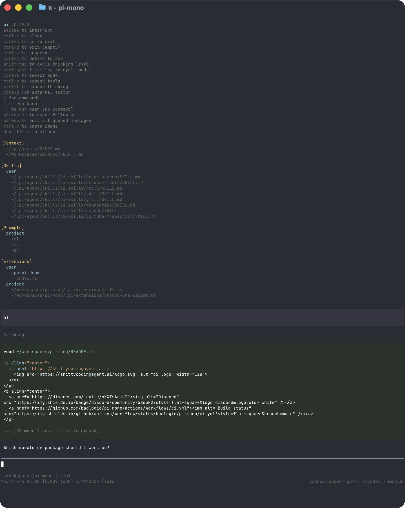

# Using Agent Core

This page is the main user manual: installation, day-to-day usage, sessions, and the CLI reference.

## Install and Uninstall

Agent Core is distributed as an npm package:

```bash
npm install -g --ignore-scripts @liuxuedeng/agent-core
```

`--ignore-scripts` disables dependency lifecycle scripts during install. Agent Core does not require install scripts for normal npm installs.

Then start it in the project directory you want it to work on:

```bash
cd /path/to/project
agent-core
```

### Uninstall

Use the package manager that installed Agent Core:

```bash
# npm install -g
npm uninstall -g @liuxuedeng/agent-core

# pnpm
pnpm remove -g @liuxuedeng/agent-core

# Yarn
yarn global remove @liuxuedeng/agent-core

# Bun
bun uninstall -g @liuxuedeng/agent-core
```

Uninstalling Agent Core leaves settings, credentials, sessions, and installed packages in `~/.agent-core/agent/`.

## Authenticate

Agent Core can use subscription providers through `/login`, or API-key providers through environment variables or the auth file.

- **Subscription login:** start Agent Core and run `/login`, then select a provider. Built-in subscription logins include Claude Pro/Max, ChatGPT Plus/Pro (Codex), and GitHub Copilot.
- **API key:** set an API key before launching, for example `export ANTHROPIC_API_KEY=sk-ant-...`, then run `agent-core`. You can also run `/login` and select an API-key provider to store the key in `~/.agent-core/agent/auth.json`.

See [Models and Providers](models.md) for all supported providers, environment variables, and cloud-provider setup.

## Interactive Mode

<p align="center"></p>

The interface has four main areas:

- **Startup header** - shortcuts, loaded context files, prompt templates, skills, and extensions
- **Messages** - user messages, assistant responses, tool calls, tool results, notifications, errors, and extension UI
- **Editor** - where you type; border color indicates the current thinking level
- **Footer** - working directory, session name, token/cache usage, cost, context usage, and current model. Totals include assistant responses, usage reported by tools, and summary generation.

The editor can be replaced temporarily by built-in UI such as `/settings` or by custom extension UI.

### Editor Features

| Feature | How |
|---------|-----|
| File reference | Type `@` to fuzzy-search project files |
| Path completion | Press Tab to complete paths |
| Multi-line input | Shift+Enter, or Ctrl+Enter on Windows Terminal |
| Images | Paste with Ctrl+V, Alt+V on Windows, or drag into the terminal |
| Shell command | `!command` runs and sends output to the model |
| Hidden shell command | `!!command` runs without sending output to the model |
| External editor | Ctrl+G opens `externalEditor`, `$VISUAL`, `$EDITOR`, Notepad on Windows, or `nano` elsewhere |

See [Keybindings](keybindings.md) for all shortcuts and customization.

## Slash Commands

Type `/` in the editor to open command completion. Extensions can register custom commands, skills are available as `/skill:name`, and prompt templates expand via `/templatename`.

| Command | Description |
|---------|-------------|
| `/login`, `/logout` | Manage OAuth or API-key credentials |
| `/model` | Switch models; Ctrl+S in the picker saves the startup default |
| `/thinking` | Switch thinking level; Ctrl+S in the picker saves the startup default |
| `/settings` | Theme, message delivery, transport, and other preferences |
| `/resume` | Pick from previous sessions |
| `/new` | Start a new session |
| `/name <name>` | Set session display name |
| `/session` | Show session file, ID, messages, tokens, and cost |
| `/tree` | Jump to any point in the session and continue from there |
| `/trust` | Save project trust decision for future sessions |
| `/fork` | Create a new session from a previous user message |
| `/clone` | Duplicate the current active branch into a new session |
| `/compact [prompt]` | Manually compact context, optionally with custom instructions |
| `/export [file]` | Export session to HTML or JSONL |
| `/import <file>` | Import and resume a session from a JSONL file |
| `/reload` | Reload keybindings, extensions, skills, prompts, themes, and context files |
| `/hotkeys` | Show all keyboard shortcuts |
| `/changelog` | Display version history |
| `/quit` | Quit agent-core |

## Message Queue

You can submit messages while the agent is still working:

- **Enter** queues a steering message, delivered after the current assistant turn finishes executing its tool calls.
- **Alt+Enter** queues a follow-up message, delivered after the agent finishes all work.
- **Escape** aborts and restores queued messages to the editor.
- **Alt+Up** retrieves queued messages back to the editor.

On Windows Terminal, Alt+Enter is fullscreen by default. Remap it as described in [Terminal setup](terminal-setup.md) if you want agent-core to receive the shortcut.

Configure delivery in [Settings](settings.md) with `steeringMode` and `followUpMode`.

## Sessions

Agent Core saves conversations as sessions so you can continue work, branch from earlier turns, and revisit previous paths.

### Session Storage

Sessions auto-save to `~/.agent-core/agent/sessions/`, organized by working directory. Each session is a JSONL file with a tree structure.

```bash
agent-core -c                  # Continue most recent session
agent-core -r                  # Browse and select from past sessions
agent-core --no-session        # Ephemeral mode; do not save
agent-core --name "my task"    # Set session display name at startup
agent-core --session <path|id> # Use a specific session file or partial session ID
agent-core --fork <path|id>    # Fork a session file or partial session ID into a new session
```

Use `/session` in interactive mode to see the current session file, session ID, message count, tokens, and cost.

For the JSONL file format and SessionManager API, see [Session Format](session-format.md).

### Session Commands

| Command | Description |
|---------|-------------|
| `/resume` | Browse and select previous sessions |
| `/new` | Start a new session |
| `/name <name>` | Set the current session display name |
| `/session` | Show session info |
| `/tree` | Navigate the current session tree |
| `/fork` | Create a new session from a previous user message |
| `/clone` | Duplicate the current active branch into a new session |
| `/compact [prompt]` | Summarize older context; see [Compaction](compaction.md) |
| `/export [file]` | Export session to HTML |

### Resuming and Deleting Sessions

`/resume` opens an interactive session picker for the current project. `agent-core -r` opens the same picker at startup.

In the picker you can:

- search by typing
- toggle path display with Ctrl+P
- toggle sort mode with Ctrl+S
- filter to named sessions with Ctrl+N
- rename with Ctrl+R
- delete with Ctrl+D, then confirm

When available, agent-core uses the `trash` CLI for deletion instead of permanently removing files.

### Naming Sessions

Use `/name <name>` to set a human-readable session name:

```text
/name Refactor auth module
```

Set the name at startup with `--name` or `-n`:

```bash
agent-core --name "Refactor auth module"
agent-core --name "CI audit" -p "Review this build failure"
```

Named sessions are easier to find in `/resume` and `agent-core -r`.

### Branching with `/tree`

Sessions are stored as trees. Every entry has an `id` and `parentId`, and the current position is the active leaf. `/tree` lets you jump to any previous point and continue from there without creating a new file.

<p align="center"></p>

Example shape:

```text
├─ user: "Hello, can you help..."
│  └─ assistant: "Of course! I can..."
│     ├─ user: "Let's try approach A..."
│     │  └─ assistant: "For approach A..."
│     │     └─ user: "That worked..."  ← active
│     └─ user: "Actually, approach B..."
│        └─ assistant: "For approach B..."
```

#### Tree Controls

| Key | Action |
|-----|--------|
| ↑/↓ | Navigate visible entries |
| ←/→ | Page up/down |
| Ctrl+←/Ctrl+→ or Alt+←/Alt+→ | Fold/unfold or jump between branch segments |
| Shift+L | Set or clear a label on the selected entry |
| Shift+T | Toggle label timestamps |
| Enter | Select entry |
| Escape/Ctrl+C | Cancel |
| Ctrl+O | Cycle filter mode |

Filter modes are: default, no-tools, user-only, labeled-only, and all. Configure the default with `treeFilterMode` in [Settings](settings.md).

#### Selection Behavior

Selecting a user or custom message:

1. Moves the leaf to the selected message's parent.
2. Places the selected message text in the editor.
3. Lets you edit and resubmit, creating a new branch.

Selecting an assistant, tool, compaction, or other non-user entry:

1. Moves the leaf to that entry.
2. Leaves the editor empty.
3. Lets you continue from that point.

Selecting the root user message resets the leaf to an empty conversation and places the original prompt in the editor.

### `/tree`, `/fork`, and `/clone`

| Feature | `/tree` | `/fork` | `/clone` |
|---------|---------|---------|----------|
| Output | Same session file | New session file | New session file |
| View | Full tree | User-message selector | Current active branch |
| Typical use | Explore alternatives in place | Start a new session from an earlier prompt | Duplicate current work before continuing |
| Summary | Optional branch summary | None | None |

Use `/tree` when you want to keep alternatives together. Use `/fork` or `/clone` when you want a separate session file.

### Branch Summaries

When `/tree` switches away from one branch to another, agent-core can summarize the abandoned branch and attach that summary at the new position. This preserves important context from the path you left without replaying the whole branch.

When prompted, choose one of:

1. no summary
2. summarize with the default prompt
3. summarize with custom focus instructions

See [Compaction](compaction.md) for branch summarization internals and extension hooks.

## Context Files

Agent Core loads `AGENTS.md` or `CLAUDE.md` at startup from:

- `~/.agent-core/agent/AGENTS.md` for global instructions
- parent directories, walking up from the current working directory
- the current directory

If a directory contains `AGENTS.override.md`, Agent Core loads it instead of `AGENTS.md` or `CLAUDE.md` from that directory. Context files from other directories still layer normally.

Use context files for project conventions, commands, safety rules, and preferences. Disable loading with `--no-context-files` or `-nc`.

### System Prompt Files

Replace the default system prompt with:

- `.agent-core/SYSTEM.md` for a project
- `~/.agent-core/agent/SYSTEM.md` globally

Append to the default prompt without replacing it with `APPEND_SYSTEM.md` in either location.

### Project Trust

On interactive startup, Agent Core asks before trusting a project folder that contains project-local settings, resources, or project `.agents/skills` and has no saved decision for the folder or a parent folder in `~/.agent-core/agent/trust.json`. Trusting a project allows agent-core to load project settings (`.agent-core/settings.json`) and project resources under `.agent-core/`, install missing project packages, and execute project extensions.

Before the trust decision, agent-core loads only context files, user/global extensions, and CLI `-e` extensions so they can handle the `project_trust` event. Project-local extensions, project package-managed extensions, and project settings are loaded only after the project is trusted. This split also applies when switching to a session from a different cwd whose trust has not been resolved in the current process.

Non-interactive modes (`-p`, `--mode json`, and `--mode rpc`) do not show a trust prompt. Without an applicable saved trust decision, they use `defaultProjectTrust` from global settings: `ask` (default) and `never` ignore those project resources, while `always` trusts them. Pass `--approve`/`-a` or `--no-approve`/`-na` to override project trust for one run.

If no extension or saved decision applies, `defaultProjectTrust` controls the fallback behavior. Set it to `"ask"`, `"always"`, or `"never"` in `~/.agent-core/agent/settings.json`, or change it with `/settings`.

`agent-core config` and package commands use the same project trust flow, except `agent-core update` never prompts. Pass `--approve` to trust project-local settings for one command or `--no-approve` to ignore them.

Use `/trust` in interactive mode to save a project trust decision for future sessions, including trust for the immediate parent folder. It writes `~/.agent-core/agent/trust.json` only; the current session is not reloaded, so restart agent-core for changes to take effect.


## Exporting Sessions

Use `/export [file]` to write a session to HTML.

If you use Agent Core for open source work and want to publish sessions for model, prompt, tool, and evaluation research, see [`badlogic/pi-share-hf`](https://github.com/badlogic/pi-share-hf). It publishes sessions to Hugging Face datasets.

## CLI Reference

```bash
agent-core [options] [--] [@files...] [messages...]
```

### Package Commands

```bash
agent-core install <source> [-l]     # Install package, -l for project-local
agent-core remove <source> [-l]      # Remove package
agent-core uninstall <source> [-l]   # Alias for remove
agent-core update [source|self]      # Update agent-core only, or one package source
agent-core update --all              # Update agent-core and packages; reconcile pinned git refs
agent-core update --extensions       # Update packages only; reconcile pinned git refs
agent-core update --models           # Refresh model catalogs only
agent-core update --self             # Update agent-core only
agent-core update --extension <src>  # Update one package
agent-core list                      # List installed packages
agent-core config                    # Enable/disable package resources
```

These commands manage Agent Core packages and `agent-core update` can update the agent-core CLI installation. To uninstall agent-core itself, see [Uninstall](#uninstall). `agent-core config` and project package commands accept `--approve`/`--no-approve` to trust or ignore project-local settings for one command. `agent-core update` never prompts for project trust.

See [Agent Core Packages](packages.md) for package sources and security notes.

### Modes

| Flag | Description |
|------|-------------|
| default | Interactive mode |
| `-p`, `--print` | Print response and exit |
| `--mode json` | Output all events as JSON lines; see [Print JSON event stream](rpc.md#print-json-event-stream) |
| `--mode rpc` | RPC mode over stdin/stdout; see [RPC mode](rpc.md) |
| `--export <in> [out]` | Export a session to HTML |

In print mode, agent-core also reads piped stdin and merges it into the initial prompt:

```bash
cat README.md | agent-core -p "Summarize this text"
```

### Model Options

| Option | Description |
|--------|-------------|
| `--provider <name>` | Provider, such as `anthropic`, `openai`, or `google` |
| `--model <pattern>` | Model pattern or ID; supports `provider/id` and optional `:<thinking>` |
| `--api-key <key>` | API key, overriding environment variables |
| `--thinking <level>` | `off`, `minimal`, `low`, `medium`, `high`, `xhigh`, `max` |
| `--list-models [search]` | List available models |

### Session Options

| Option | Description |
|--------|-------------|
| `-c`, `--continue` | Continue the most recent session |
| `-r`, `--resume` | Browse and select a session |
| `--session <path\|id>` | Use a specific session file or partial UUID |
| `--fork <path\|id>` | Fork a session file or partial UUID into a new session |
| `--session-dir <dir>` | Custom session storage directory |
| `--no-session` | Ephemeral mode; do not save |
| `--name <name>`, `-n <name>` | Set session display name at startup |

### Tool Options

| Option | Description |
|--------|-------------|
| `--tools <list>`, `-t <list>` | Allowlist specific built-in, extension, and custom tools |
| `--exclude-tools <list>`, `-xt <list>` | Disable specific built-in, extension, and custom tools |
| `--no-builtin-tools`, `-nbt` | Disable built-in tools but keep extension/custom tools enabled |
| `--no-tools`, `-nt` | Disable all tools |

Built-in tools: `read`, `bash`, `powershell` (Windows), `edit`, `write`, `grep`, `find`, `ls`.

### Resource Options

| Option | Description |
|--------|-------------|
| `-e`, `--extension <source>` | Load an extension from path, npm, or git; repeatable |
| `--no-extensions` | Disable extension discovery |
| `--skill <path>` | Load a skill; repeatable |
| `--no-skills` | Disable skill discovery |
| `--prompt-template <path>` | Load a prompt template; repeatable |
| `--no-prompt-templates` | Disable prompt template discovery |
| `--theme <path>` | Load a theme; repeatable |
| `--no-themes` | Disable theme discovery |
| `--no-context-files`, `-nc` | Disable `AGENTS.md` and `CLAUDE.md` discovery |

Combine `--no-*` with explicit flags to load exactly what you need, ignoring settings. Example:

```bash
agent-core --no-extensions -e ./my-extension.ts
```

### Other Options

| Option | Description |
|--------|-------------|
| `--system-prompt <text>` | Replace default prompt; context files and skills are still appended |
| `--append-system-prompt <text>` | Append to system prompt |
| `--tui-mode <mode>` | TUI mode: `regular` (default) or experimental `fullscreen` |
| `--use-theme <name[/name]>` | Set the initial interactive theme for this run without changing settings |
| `--verbose` | Force verbose startup |
| `-a`, `--approve` | Trust project-local files for this run |
| `-na`, `--no-approve` | Ignore project-local files for this run |
| `--` | Stop option parsing; remaining arguments are prompts or `@file` inputs |
| `-h`, `--help` | Show help |
| `-v`, `--version` | Show version |

In `fullscreen` mode, the transcript scrolls inside the terminal viewport while queued messages, working status, extension widgets, editor, and footer remain fixed at the bottom. Mouse/trackpad input scrolls the region under the pointer; keyboard viewport actions always remain available. Inline images work in terminals that support the Kitty graphics protocol, including Kitty and Ghostty. In iTerm2 they render as text placeholders because its inline-image protocol cannot delete or crop placements during application-owned scrolling. In `regular` mode, agent-core uses the main screen and terminal-owned scrollback, and iTerm2 inline images continue to render normally. See [Terminal setup](terminal-setup.md) for terminal-specific settings and workarounds.

Set **TUI mode** in `/settings` to switch between `regular` and `fullscreen` immediately and choose the default for future sessions. **Fullscreen exit output** controls whether exiting fullscreen prints the final transcript or restores the previous screen and prints only the session resume hint.

### File Arguments

Prefix files with `@` to include them in the message:

```bash
agent-core @prompt.md "Answer this"
agent-core -p @screenshot.png "What's in this image?"
agent-core @code.ts @test.ts "Review these files"
```

### Examples

```bash
# Interactive with initial prompt
agent-core "List all .ts files in src/"

# Non-interactive
agent-core -p "Summarize this codebase"

# Prompt beginning with a dash
agent-core -p -- "- Summarize these points"

# Non-interactive with piped stdin
cat README.md | agent-core -p "Summarize this text"

# Named one-shot session
agent-core --name "release audit" -p "Audit this repository"

# Different model
agent-core --provider openai --model gpt-4o "Help me refactor"

# Model with provider prefix
agent-core --model openai/gpt-4o "Help me refactor"

# Model with thinking level shorthand
agent-core --model sonnet:high "Solve this complex problem"

# Read-only mode
agent-core --tools read,grep,find,ls -p "Review the code"

# Disable one extension or built-in tool while keeping the rest available
agent-core --exclude-tools ask_question
```

## Design Principles

Agent Core keeps the core small and pushes workflow-specific behavior into extensions, skills, prompt templates, and packages.

It intentionally does not include built-in MCP, sub-agents, permission popups, plan mode, to-dos, or background bash. You can build or install those workflows as extensions or packages, or use external tools such as containers and tmux.

For the full rationale, read the [blog post](https://mariozechner.at/posts/2025-11-30-pi-coding-agent/).
